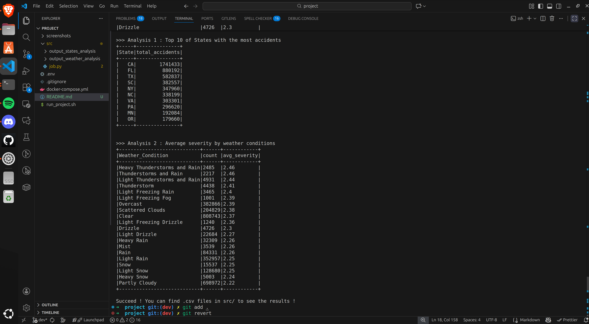
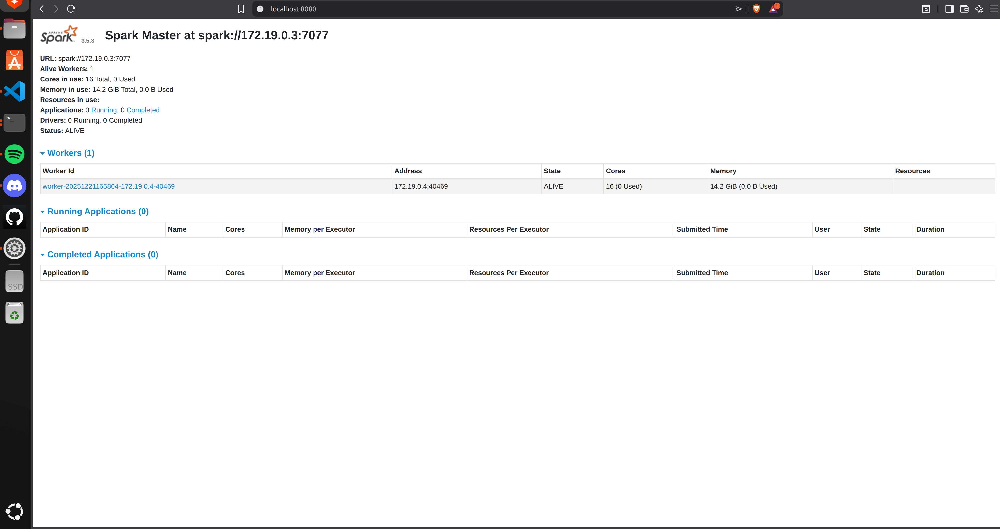
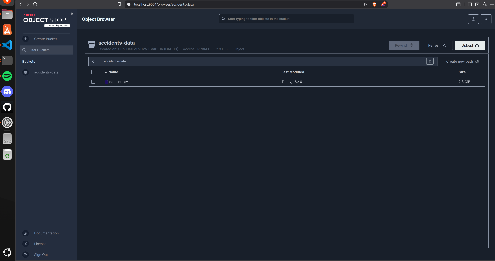
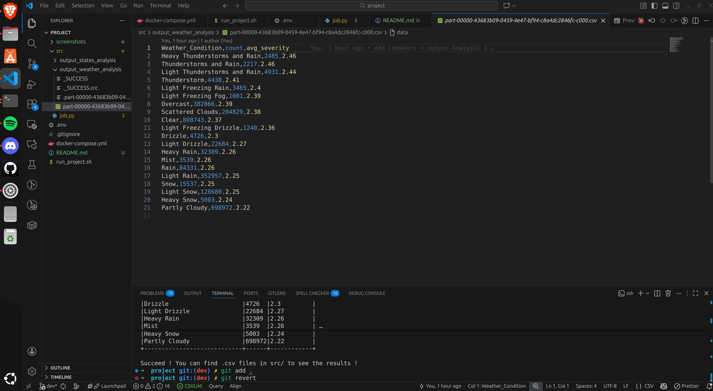
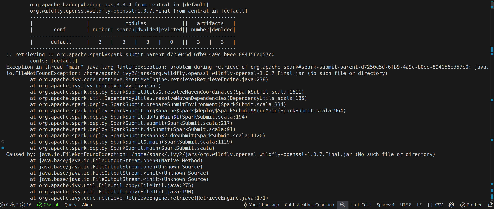

# US Accidents Analysis - Big Data Project - Loan PERRARD & Quentin HEITZ GR03

## 1. Project Overview
This project is about processing and analyzing a large dataset (7.7M rows) of US accidents. The main goal wasn't just to run some SQL queries, but to build a proper **Cloud-Native architecture** on our local machines. 

Instead of reading a CSV file directly from a local folder, we set up a **Separation of Storage and Compute**. We used MinIO to act as a Data Lake (S3) and Spark to handle the processing. This way, the data and the logic are completely decoupled, just like in a real AWS or GCP production environment.

## 2. Technical Stack
* **Processing:** Apache Spark 3.5.3 (Official Image)
* **Storage:** MinIO (S3-compatible Object Storage)
* **Infrastructure:** Docker & Docker Compose
* **Environment:** Python (PySpark) & Bash for automation

## 3. Why we chose this setup
### Why we selected these tools

* **Apache Spark**: It is the industry standard for distributed computing. We wanted to see how it handles millions of lines in-memory without crashing our local machines. It’s much more efficient than traditional MapReduce.
* **MinIO**: Instead of just reading files from a local folder, we integrated MinIO to simulate a real-world Cloud Data Lake (like AWS S3). It allowed us to master the **S3A protocol**, which is a core skill for any Data Engineer today without spending money for credits in AWS or GCP.
* **Docker**: This was a lifesaver. We didn't want to spend hours installing Java, Spark, and Scala on our laptops with potential version conflicts. Docker allowed us to define our entire infrastructure as code. It ensures that if the project runs on our machine, it will run exactly the same way on yours.


## 4. Installation Steps

Setting up this environment required several technical steps to ensure Spark could communicate with MinIO and handle our large dataset efficiently. Here is exactly what we did to build this architecture:

### 4.1 Environment Containerization
We started by creating a `docker-compose.yml` file to orchestrate our infrastructure. We used the official `apache/spark:3.5.3` image for both the Master and the Worker to ensure version parity. We also added a `minio/minio` service to act as our S3-compatible storage layer.

### 4.2 Handling S3 Connectivity
By default, standard Spark images do not come with S3 drivers. We configured our `spark-submit` command to dynamically inject the following Maven packages at runtime:
* `hadoop-aws:3.3.4`
* `aws-java-sdk-bundle:1.12.262`

This allowed Spark to recognize the `s3a://` protocol without us having to build a custom, heavy Docker image.

### 4.3 Permission and User Management
One major hurdle was the discrepancy between our host machine's user and the internal `spark` user in Docker. 
1. We mapped a local `src/` folder to the container's `/opt/spark/work-dir` via Docker volumes.
2. We used `chmod -R 777` on the local source directory to ensure that the Spark container had full write access to save the output files without "Permission Denied" errors.

### 4.4 Secret Management
To avoid hardcoding sensitive information like the MinIO admin password, we implemented a `.env` file. We then mapped these environment variables in the `docker-compose.yml` so they could be accessed securely by our `job.py` script using the Python `os` library.

### 4.5 Automation Layer
Finally, we wrote a `run_project.sh` Bash script. We did this to automate the repetitive tasks: clearing old containers, starting the new cluster, waiting for the services to be ready, and finally submitting the Spark job with all the correct configurations and packages in one go.

## 5. Minimal Working Example

For this project, we developed a processing pipeline that demonstrates a full data lifecycle without needing complex local installations. Instead of showing the raw code here (which is available in `job.py`), we describe the functional steps our example performs:

* **Data Ingestion**: The system connects to the MinIO "Data Lake" via the S3A protocol and reads the 7.7 million rows dataset.
* **Schema Inference**: Spark automatically analyzes the data to detect column types (identifying state as STRING, severity as an integer, etc...).
* **Distributed Aggregation**: We run a SQL-based analysis to calculate the amount of accidents in each state and the average severity of accidents grouped by weather conditions (e.g., Rain, Fog, Clear).
* **Data Loading**: The final aggregated results are written back from the Spark cluster's memory into a persistent CSV file in our local `src/` directory.

This example proves that Spark can handle massive files stored remotely as if they were local, while distributing the computation across a cluster.

---

## 6. Execution Proof

### 6.1 Terminal Output
Below is the final table generated by Spark after processing the 7.7M rows:



### 6.2 Spark Master UI
We can verify here that the application "US_Accidents_S3" was successfully executed by our worker:



### 6.3 MinIO Data Lake
The dataset was correctly uploaded and stored in our local object storage:



### 6.4 Outpul files 
Below is the output file with the query result exported



---

## 7. Big Data Ecosystem Fit

Our project illustrates several core Big Data concepts taught in class:

* **Distributed Computing (Spark)**: Our setup shows the power of Apache Spark in a Master/Worker architecture. Spark is the engine that handles the "Volume" of Big Data by splitting the 7.7M rows across the cluster to process them in parallel.
* **Infrastructure as Code (Docker)**: Docker is a key part of our ecosystem. In a professional setting, setting up Big Data tools is often a nightmare of version conflicts. Docker ensures our environment is portable and reproducible; we can deploy this exact same cluster on any machine without worrying about local dependencies.
* **Separation of Storage and Compute**: This is the most important part. By using MinIO (Storage) and Spark (Compute) as separate containers, we mimic how modern companies use AWS S3. It allows us to scale the number of Workers without needing more storage.

---

## 8. Challenges & Solutions

* **Port 8080 Collision**: On our first attempt, the Spark UI wouldn't start because another service was using the port. We solved this by identifying the process and clearing the port, ensuring the Master UI was accessible.
* **Docker Write Permissions**: At first, Spark couldn't save the results to our computer. We realized that Docker users often have different IDs than the host user. We solved this by adding a `chmod -R 777` command in our setup script to synchronize permissions.
* **Missing Drivers**: Official Spark images are kept small and don't include S3 support. We solved this by using the `--packages` flag in our execution script to download the necessary S3A/AWS jars at runtime.
* **Cloud Budget Constraints**: Since we didn't have free credits for public cloud providers like AWS or GCP, we had to find a way to simulate a real cloud environment for free. **MinIO** was our solution: it allowed us to use the **S3A protocol** and manage our data as an Object Store directly on our local machines.
  
---

## 9. My Setup Notes: The Ivy Permission Struggle

**The Problem:**
The biggest technical hurdle we faced was during the dependency download. Spark uses a manager called **Ivy** to get S3 drivers. However, the official Apache image runs as a user named `spark` who doesn't have the right to write in its own home directory (`/home/spark/.ivy2`). This caused a "Permission Denied" crash every time we tried to run the job.

**The Solving Process:**
We spent time analyzing the Java stack trace and realized the issue was specifically about the cache location. We couldn't easily change the image permissions without making it "heavy," so we looked for a way to tell Spark to use a different folder.

**The Solution:**
We discovered we could override the Ivy cache location using Spark's internal configurations. By re-routing the cache to the `/tmp` folder (which is always writable), we bypassed the security restriction of the official image.

**Log Snippet of the fix:**
```bash
--conf "spark.driver.extraJavaOptions=-Divy.cache.dir=/tmp/.ivy2/cache"
--conf "spark.jars.ivy=/tmp/.ivy2/jars"
```
**Error log showing the permission issue:**



## 10. Installation & Setup

We designed the project to be as automated as possible. You only need Docker installed; no local Spark installation is required.

### 10.1 Prerequisites
* **Docker & Docker Compose** installed.
* A **Kaggle account** to get the raw data.

### 10.2 Step 1: Clone and Configure
Clone this repository and create a `.env` file at the root to store the credentials. This file is ignored by Git for security:

```env
MINIO_ROOT_USER=admin
MINIO_ROOT_PASSWORD=password123
```

### 10.3 Step 2: Prepare the Data Lake (MinIO)
Since Kaggle requires a manual login to download datasets, you need to handle the data transfer yourself:

* **Download the data**: Get the CSV file from the official [Kaggle US Accidents page](https://www.kaggle.com/datasets/sobhanmoosavi/us-accidents).
* **Start the infrastructure**: Run `docker compose up -d` to launch the Spark cluster and MinIO.
* **Access the UI**: Open your browser and go to `http://localhost:9001`.
* **Authentication**: Login using the **MINIO_ROOT_USER** and **MINIO_ROOT_PASSWORD** you defined in your `.env` file.
* **Create a Bucket**: Create a new bucket named **`accidents-data`**.
* **Upload**: Upload your `dataset.csv` into this bucket. 

Your local **Data Lake** is now ready and persistent thanks to Docker volumes.

### 10.4 Step 3: Run the Analysis
Instead of typing long and repetitive Docker commands, we wrote a `run_project.sh` script to automate the entire pipeline in the correct order.

**What the script does:**
1. **Fixes permissions**: It runs `chmod` on the `src/` folder so the Docker container has the right to write the results back to your machine.
2. **Cluster Sync**: It waits for the Spark Master and Workers to be fully "ALIVE".
3. **Job Submission**: It submits the `job.py` script with the necessary S3/AWS packages.

To start the process, run these commands in your terminal:

```bash
# Give execution rights to the script
chmod +x run_project.sh

# Start the pipeline
./run_project.sh
```
### Monitoring Result 
* **Logs** You can watch the execution logs directly in your terminal.
* **Output** : Once finished, the aggregated data will be saved in the src/output_weather_analysis and src/output_states_analysis directories.
